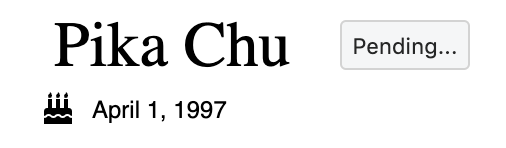

# Fakebook


[Fakebook](https://derek-shue-fb-clone.herokuapp.com/) is a Facebook clone complete with functionality for making posts, adding and searching for friends, and liking and commenting on friends' posts. 

## Stack
* Ruby on Rails
* Postgres
* jQuery
* Javascript
* Webpack
* React
* Redux
* HTML
* CSS
* FontAwesome
* Heroku

Rails was used on the backend with a Postgres server and jQuery for handling view pages. Javascript (bundled with Webpack) was used on the frontend alongside React/Redux. HTML and CSS were used for styling purposes, the FontAwesome library was used to add icons, and final deployment took place on Heroku.

## Newsfeed
Upon login, the user is directed to the Newsfeed. The Newsfeed contains all of the posts made by the user and the user's friends. Each post is listed in reverse chronological order (most recent first), and includes the functionality of being able to like, comment, or reply to existing comments.


The top center features a form used to create a new post. Clicking "Post" will cause a rerender and will display the new post at the top of the feed (right below the form since the posts are in reverse chronlogical order) and will also appear on the Profile of the post's author. Each post is able to be liked and commented on, and the font size changes depending on the length of the post. If a user has liked a post, the like button will be shown in blue, and the number of likes will be updated. The user will also not be able to like the post an additional time. Comments can be replied to and are shown by indenting the reply.

```
this.props.fetchPosts().then(
    () => this.props.fetchUsers()).then(
        () => this.props.fetchFriendships()).then(
            () => this.setState({ friendships: this.getFriendships() })).then(
                () => this.setState({ friendIds: this.getFriendIds() }));
this.props.fetchComments();
```

Since the Newsfeed was such a large entity, rendering efficiently was of major importance, especially considering that a social-media network would eventually have an extremely large number of users. To guarantee load efficiency, each slice of data state is loaded only a single time. However, since much of the data requires data from other slices of state, it was vital to fetch data from the database in a sequential order. The code above, in which only Posts and Comments are fetched asynchronously, ensures avoiding an N+1 query or making the same query multiple times.

## Profile

A button in the top blue header on every page containing the User's name will direct to the user's profile. The user's profile contains basic info about the user as well as all posts written by or to the user.


The bio on the left side of the page is only able to be edited if it is the bio of the user that is currently logged in. Similarly to the Newsfeed, the user's profile page contains a form allowing the user to post. However, posts can be written directly to other users by posting on their profile page, as seen in the first post in the image above.

```
if (!this.props.post.receiver_id || this.props.post.receiver_id === this.props.user.id){
    return <Link to={`/users/${this.props.user.id}`} className="post-author">{this.props.user.fname + ' ' + this.props.user.lname}</Link>
} else {
    const show_page_user = this.props.users[this.props.post.receiver_id];
    //debugger;
    return (
        <div>
            <Link to={`/users/${this.props.user.id}`} className="post-author">{this.props.user.fname + ' ' + this.props.user.lname}</Link>
            <FontAwesomeIcon className="right-caret" icon={faCaretRight} />
            <Link to={`/users/${show_page_user.id}`} className="post-author">{show_page_user.fname + ' ' + show_page_user.lname}</Link>
        </div>
    )
}
```

To allow users being able to post on other users' profiles, created posts need to take in a "receiver_id" attribute. When loading posts, if a post has a receiver_id value, the name of the author (and a link to his/her profile) will be displayed. If not, only the name of the profile's user will be displayed.

## Friendships

Perhaps the most difficult feature to incorporate into this application was friendships. Please compare the following images with the image above. 





These images show all the possible states that friendships can be in: either there is no existing friendship or it is pending, accepted, or rejected. (A rejected friendship will show no button so that no one's feelings will get hurt). The logged in user's own profile will also not display a button.

```
if (!friendship){
    return this.addFriendButton();
}
else if ((friendship.status === 'pending' || friendship.status === 'rejected') && 
friendship.requestor_id === this.props.current_user.id) {
    return <button className="add-friend">Pending...</button>
}
else if (friendship.status === 'pending'){
    return this.acceptRejectButton(friendship);
}
else if (friendship.status === 'accepted'){
    return <button className="add-friend">Friends</button>
}
else if (friendship.status === 'rejected'){
    return ''
};
```

To determine which friendship button to render, upon loading, friendships are first filtered to only include relevant ones (where the friend request being sent or received involves the logged in user). If no friendship exists between the logged in user and the user of a particular profile, the "Add Friend" button will appear. Upon pressing it, it will become a "Pending..." button. If a friend request is received, there will be options to either accept or reject the friend request. And if the friend request is accepted, a "Friends" button will be displayed.

## Other Features
* Search Bar with links to user profiles
* Protected routes based on login and friend status
* Error rendering on failed signup/login

## Future Directions
* Ability to post photos and profile pictures
* Notifications (including for friend requests)
* Direct private messaging